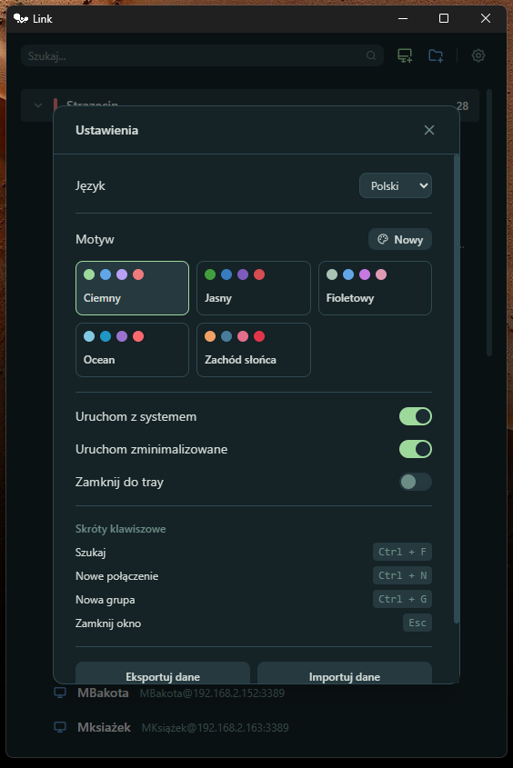
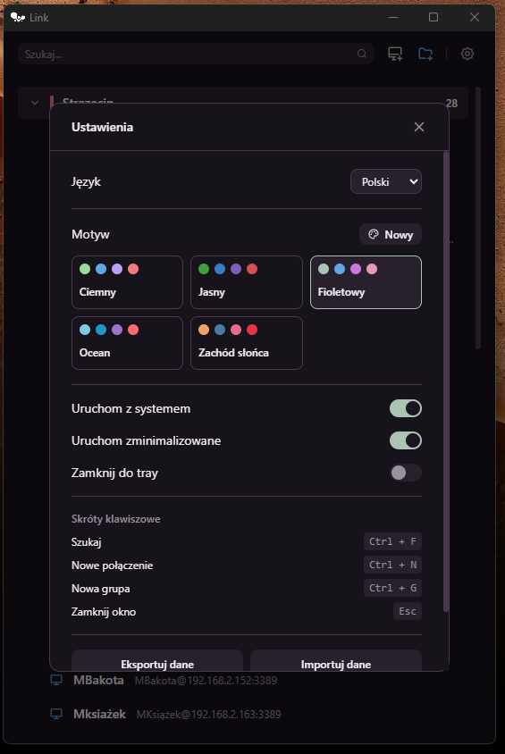
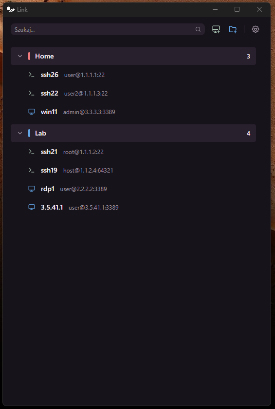
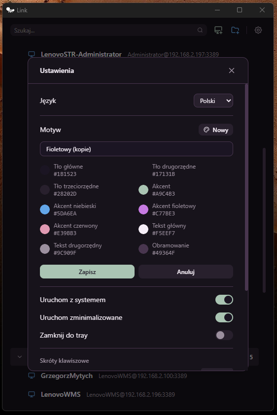
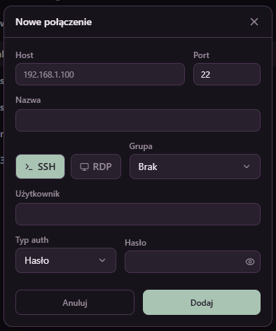
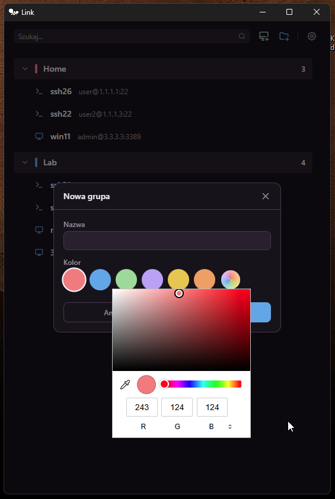

<div align="center">

# Link

**Menedżer połączeń SSH i RDP**

Zarządzaj swoimi połączeniami zdalnymi z jednego miejsca. Szybki, lekki, z wieloma motywami i wsparciem języków.

[](https://github.com/eincherjar/link/releases)
[](LICENSE)
[](https://github.com/eincherjar/link/releases)

</div>

---

## Screenshots

| Ciemny motyw | Fioletowy motyw |
|:---:|:---:|
|  |  |

| Zarządzanie połączeniami | Edytor motywów |
|:---:|:---:|
|  |  |

| Nowe połączenie | Nowa grupa |
|:---:|:---:|
|  |  |

---

## Funkcje

- **Połączenia SSH i RDP** — uruchamiaj bezpośrednio z aplikacji
- **Grupy** — organizuj połączenia z kolorowym sortowaniem
- **Motywy** — 5 wbudowanych + twórz własne z pełnym edytorem kolorów
- **Wielojęzyczność** — Polski, English + twórz własne języki z edytorem tłumaczeń
- **Import/Export z podglądem** — przed importem zobaczysz co zostanie dodane/zastąpione/pominięte
- **Detekcja duplikatów** — klucz: `protocol://user@host:port`, 3 strategie importu
- **Wyczyść wszystko** — usuń wszystkie dane z potwierdzeniem
- **System tray** — minimalizuj do tacki systemowej
- **Autostart** — uruchamiaj z systemem
- **Wyszukiwanie** — po nazwie, hoście, userze, protokole, grupie
- **Skróty klawiszowe** — `Ctrl+F` szukaj, `Ctrl+N` nowe połączenie, `Ctrl+G` nowa grupa, `Esc` zamknij
- **Dane w systemowym katalogu** — połączenia i ustawienia zapisywane w `app_data_dir`

---

## Instalacja

Pobierz najnowszą wersję z [Releases](https://github.com/eincherjar/link/releases):

| Format | Opis |
|--------|------|
| `Link_0.1.5_x64_en-US.msi` | Installer MSI (Windows Installer) |
| `Link_0.1.5_x64-setup.exe` | Installer NSIS |

---

## Budowanie ze źródeł

Wymagania:
- [Node.js](https://nodejs.org/) 18+
- [Rust](https://rustup.rs/)
- [Tauri Prerequisites](https://tauri.app/start/prerequisites/)

```bash
# Klonuj repo
git clone https://github.com/eincherjar/link.git
cd link

# Instaluj zależności
npm install

# Uruchom w trybie deweloperskim
npm run tauri dev

# Zbuduj produkcję
npm run tauri build
```

---

## Technologie

| Warstwa | Technologia |
|---------|-------------|
| Frontend | React 19, Vite 8, Tailwind CSS v4 |
| Backend | Tauri v2, Rust |
| Ikony | Lucide React + custom Tabler SVGs |
| Motywy | Dynamic CSS variables z edytorem w UI |
| i18n | Custom provider z 84 kluczami tłumaczeń |

---

## Struktura projektu

```
link/
├── src/
│   ├── components/
│   │   ├── TopBar.tsx              # Pasek narzędzi
│   │   ├── GroupSection.tsx        # Sekcja grup
│   │   ├── ConnectionModal.tsx     # Modal połączenia
│   │   ├── GroupModal.tsx          # Modal grupy
│   │   ├── SettingsModal.tsx       # Ustawienia + edytor motywów
│   │   ├── ImportPreviewModal.tsx  # Podgląd importu
│   │   ├── CustomSelect.tsx        # Niestandardowy select
│   │   └── StatusBar.tsx           # Pasek statusu
│   ├── i18n/
│   │   ├── provider.tsx            # Context + hook useTranslation
│   │   ├── pl.ts                   # Polski (84 klucze)
│   │   ├── en.ts                   # English (84 keys)
│   │   └── index.ts                # Typy
│   ├── hooks/
│   │   └── useTheme.ts             # Hook motywów
│   ├── types/
│   │   └── index.ts                # Typy TypeScript + connectionKey
│   ├── themes.ts                   # Wbudowane motywy
│   ├── App.tsx                     # Główny komponent
│   └── index.css                   # Style globalne
├── src-tauri/
│   ├── src/lib.rs                  # Logika Rust (SSH, RDP, tray, persistence)
│   ├── icons/                      # Ikony aplikacji
│   └── tauri.conf.json             # Konfiguracja Tauri
├── screenshots/                    # Zrzuty ekranu
└── package.json
```

---

## Licencja

MIT

---

<div align="center">

Zbudowane z ❤️ using [Tauri](https://tauri.app), [React](https://react.dev) i [Rust](https://www.rust-lang.org)

</div>
